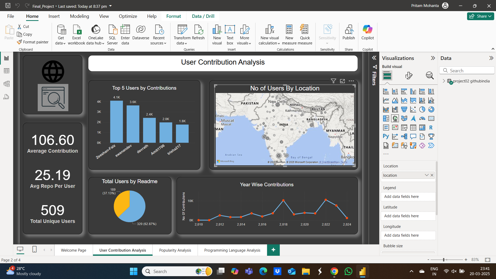

# 📌 GitHub India Dashboard Project

## 📖 Project Overview  
This project analyzes **GitHub user activity in India** by leveraging **Python, SQL, and Power BI**. The dataset contains information about user contributions, repositories, followers, programming language preferences, and engagement metrics.  

The goal is to **extract meaningful insights** from GitHub users' public profiles and create **interactive dashboards** for data visualization.  

---

## 📊 Dataset Overview  
The dataset includes the following attributes:  

- **`username`** – Unique GitHub user ID  
- **`gender_pronoun`** – Preferred pronouns (if available)  
- **`followings`** – Number of people the user follows  
- **`joining_year`** – The year the user joined GitHub  
- **`last_year_contributions`** – Contributions made in the last year  
- **`achievements_num`** – Number of GitHub achievements earned  
- **`stars`** – Total stars received on repositories  
- **`repositories`** – Number of repositories created  
- **`followers`** – Number of followers  
- **`language`** – Primary programming language used  

---

## 🚀 Project Workflow  

### ✅ Step 1: Exploratory Data Analysis (EDA) & Data Cleaning  
📍 **Tools Used:** Python (Pandas, NumPy, Matplotlib, Seaborn)  

- Handled **missing values** (e.g., `gender_pronoun`, `has_readme`).  
- Converted data types for accurate calculations (`joining_year`, `last_year_contributions`).  
- Created **bar charts & histograms** to visualize distributions.  

---

## ✅ Step 2: SQL Analysis  

📍 **Tools Used:** MySQL Workbench  

After performing **data cleaning and exploratory data analysis (EDA)**, the dataset was imported into **MySQL Workbench** for deeper insights through structured querying. The goal was to **extract key metrics** and **derive meaningful insights** about GitHub users in India.  

### 📌 Key Insights Extracted Using SQL  

✔ **Total number of users** in the dataset  
✔ **Total number of repositories** created by all users  
✔ **Average number of followers per user**  
✔ **Total number of stars received across all repositories**  
✔ **Number of users with more than 100 contributions in the last year**  
✔ **Top 3 users with the highest contributions**  
✔ **Most popular programming language based on user count**  
✔ **Users who have README files in their repositories**  
✔ **Top 3 users with the most followers**  
✔ **Users who joined GitHub before 2020**  

These insights helped us identify **engagement patterns, programming language trends, and user activity levels** in the GitHub India community.  

Once the data was structured and insights were extracted, it was connected to **Power BI** for visualization and dashboard development. 🚀  

---

## ✅ Step 3: Power BI Dashboard Development  

📍 **Tools Used:** Power BI  

After extracting insights using SQL, the dataset was connected to **Power BI** for visualization.  

### 📌 Power BI Process:  
✅ **Data Import & Modeling**  
✅ **KPI Creation & Calculations**  
✅ **Trend Analysis & Visualizations**  
✅ **Building Interactive Dashboards**  

---

## 📊 Power BI Dashboards  

### 📍 **Dashboard 1: User Contributions & Activity Overview**  

🔹 **KPIs:**  
✔ **Total Users**  
✔ **Total Contributions**  
✔ **Users with README files**  
✔ **Average Contributions**  

🔹 **Visuals:**  
✔ **Contribution trend over time**  
✔ **Users with the highest contributions**  
 

---

### 📍 **Dashboard 2: Engagement & Popularity Analysis**  

🔹 **KPIs:**  
✔ **Total Repositories**  
✔ **Total Followers**  
✔ **Most Followed Users**  
✔ **Total Stars**  

🔹 **Visuals:**  
✔ **Top users by followers**  
✔ **Growth trend of repository creation**  

---

### 📍 **Dashboard 3: Programming Language-Centric Analysis**  

🔹 **KPIs:**  
✔ **Most Popular Programming Language**  
✔ **Users per Language**  
✔ **Total Stars per Language**  

🔹 **Visuals:**  
✔ **Language distribution**  
✔ **A world map** of user locations  
✔ **Trend Analysis** of programming language adoption over the years   

---

## 🎯 Key Takeaways  

✔ **Java** is the most popular language among users.  
✔ **Users with README files** tend to have **higher engagement**.  
✔ **The majority of top contributors** joined before **2020**.  
✔ **More followers** correlate with **higher repository count**.  

---

## 🛠️ Tools & Technologies Used  

✅ **Python** (Pandas, NumPy, Matplotlib, Seaborn)  
✅ **SQL** (MySQL Workbench)  
✅ **Power BI** (Data Visualization & Dashboards)  

---

## 📌 Future Improvements  

🔹 **Add real-time GitHub API integration** for live data.  
🔹 **Enhance user segmentation analysis** based on contributions.  
🔹 **Implement predictive modeling** for **engagement trends**.  

---
